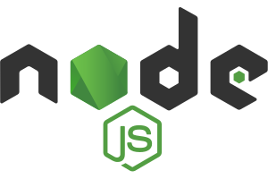
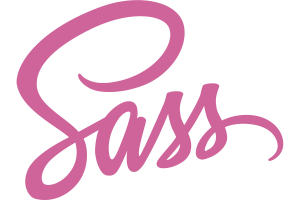

# Wikipedia-Speedrun
## Find shortest path from starting Wikipedia article to target article.

### What?
A SPA (Single-page application) in which you traverse Wikipedia articles with the goal of reaching the final article for 'Rijeka' (city in Croatia).

### How?
All the Wikipedia article links have been scraped using the [MediaWIKI API](https://www.mediawiki.org/wiki/API:Main_page) and saved to a MongoDB collection. With all the articles saved, BFS (Breadth-First Search) was performed on all the articles to find the distance from each one to the finishing article.

The frontend was built using React. It was styled with Sass, and everything was bundled up using Webpack v5.

The backend server was built with Express, and database modelling was done with Mongoose.

### Why?
The main purpose of this project is to gain knowledge and experience with the technologies used and with the application development process in general.

### Technologies used:

